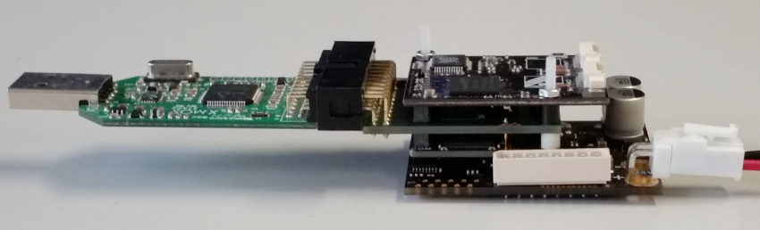
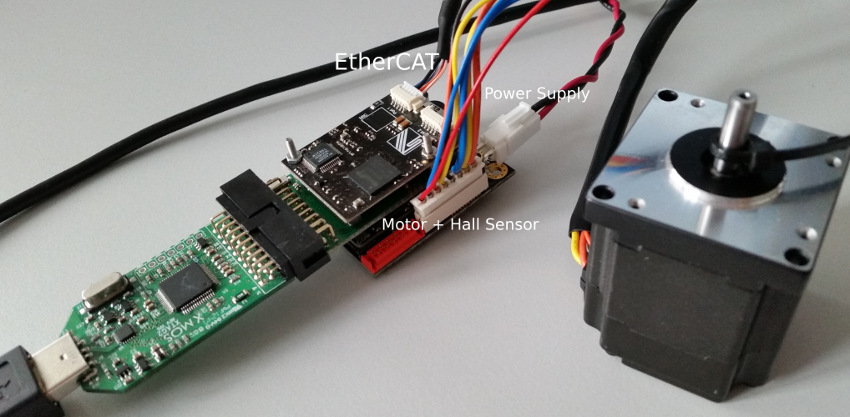

.. _SOMANET_Cyclic_Positioning_Control_with_EtherCAT_Demo_Quickstart:

SOMANET Cyclic Positioning Control with EtherCAT Demo Quickstart Guide
======================================================================

This simple demonstration shows how to control your motor using SOMANET EtherCAT motorcontrol kit from a Linux PC. Only Cyclic Synchronous Positioning control mode is included with a simple linear profile generator. The CSP control mode is designed to achieve a desired motion trajectory by using various motion profiles and closing the control loop over EtherCAT. The slave controller in its turn is taking the generated at a fixed time interval (1ms) target position setpoints as a controller input and will be following them. 

Hardware setup
++++++++++++++

A minimal requirement for this application to run is having the complete SOMANET stack assembled consisting of the SOMANET Core, SOMANET COM-EtherCAT, and SOMANET IFM Drive DC 100 modules. The stack should be powered via the SOMANET IFM board. An example of a stack consisting of the SOMANET COM-EtherCAT, Core, and IFM Drive DC 100 boards is shown below. In this case the IFM DC 100 board can be supplied with 12 - 24 V DC power source. For the motor supplied with the kit required power supply voltage should be 24 Volts. For the best experience please make sure that your stabilized DC power supply is capable of delivering more that 2 Ampers of power. Please mind that at high motor accelerations starting current may be as high as 10 times the nominal.     

   Hardware Setup for SOMANET Cyclic Positioning Control with EtherCAT Demo

To setup the system:

   #. If you don't have the stack assembled, assemble it as shown in the image above. Make sure to connect the IFM side of the SOMANET core module to the IFM DC 100 board and COM side to the Core Debug Adapter (see markings on the Core module)
   #. Connect the xTAG-2 Adapter to the Core Debug Adapter.
   #. Connect the xTAG-2 to host PC. 
   #. Connect the motor supplied with the kit as shown in the image bellow.
   #. Connect the IFM DC 100 board to a 24 V DC power supply
   #. Connect one side of the Ethernet cable to the node and plug the RS-45 connector to your PC.
   #. Switch on the power supply. If everything is connected properly, drained current should not exceed 100mA. 

   Connecting the motor and cables to your kit

Import and build the application
++++++++++++++++++++++++++++++++

   #. Open xTIMEcomposer Studio and check that it is operating in online mode. Open the edit perspective (Window->Open Perspective->XMOS Edit).
   #. Locate the ``'EtherCAT Motorcontrol CSP Demo'`` item in the xSOFTip pane on the bottom left of the window and drag it into the Project Explorer window in xTIMEcomposer. This will also cause the modules on which this application depends to be imported as well. 
   #. Click on the ``app_demo_master_cyclic_position`` item in the Project Explorer plane then click on the build icon (hammer) in xTIMEcomposer. Check the Console window to verify that the application has built successfully. Note that you require the Etherlab IgH EtherCAT driver to be installed on your system to build the application.

For help in using xTIMEcomposer, try the xTIMEcomposer tutorial, which you can find by selecting Help->Tutorials from the xTIMEcomposer menu.

Note that the Developer Column in xTIMEcomposer Studio on the right hand side of your screen provides information on the xSOFTip components you are using. Select the ``sw_sncn_motorcontrol_ethercat_kit`` component in the Project Explorer, and you will see its description together with API documentation. Having done this, click the `back` icon until you return to this quickstart guide within the Developer Column.

Run the application
+++++++++++++++++++

When the application has been compiled, the next step is to run it on the Linux PC. Before doing that, make sure that the SOMANET EtherCAT stack is running a proper motorcontrol software for the EtherCAT slave side, i.e. ``app_demo_slave_ethercat_motorcontrol``.  

   #. Make sure that the stack is recognized. For this you have to have the EtherCAT driver up and running. To start the driver on a Linux machine execute in a terminal the following command: ::

       sudo /etc/init.d/ethercat start

   #. To verify that the node is present in the system, type: ::

       ethercat slave 

   The output should indicate a presence of the SOMANET node and preoperational state if the slave side software is running: ::

       0  0:0  PREOP  +  SNCN SOMANET COM ECAT

   #. Navigate with the terminal to your compiled application binary on the hard disk. Then execute the application with super user rights: ::

       sudo ./demo-master-cyclic-position 

   #. The application will deploy the motor-specific configuration parameters over the EtherCAT and the rotor of the motor should make one rotation and hold the last position. In the terminal window you should be able to see the motor's feedback as current position, velocity, and torque ::

       actual position 12728 actual velocity 43 actual_torque 8.172973

   #. The debug console window in xTIMEcomposer will not display any message because the demo application is written to work with an EtherCAT master application and feedback is therefore provided via EtherCAT communication.

Next steps
++++++++++

As a next step you can run another EtherCAT Master Motorcontrol Demo. Two more control modes are offered: Cyclic Synchronous Velocity (``app_demo_master_cyclic_velocity``) and Cyclic Synchronous Torque (``app_demo_master_cyclic_torque``).

Examine the code
................

