.. _SOMANET_EtherCAT_Kit_HW_Quickstart:

Setting up the SOMANET EtherCAT Kit Hardware
============================================

sw_sncn_motorcontrol_ethercat demo : Hardware Quick Start Guide
---------------------------------------------------------------

Setting up without COM-EtherCAT module
++++++++++++++++++++++++++++++++++++++

This is a minimal hardware setup to start working with the motorcontrol software. Before you start, make sure that you have all  hardware components and assembly parts at hand. You will require the following items:

   #. One SOMANET IFM Drive DC 100 board.
   #. One SOMANET Core C22 module.
   #. One Core to XTAG2 Debug Adapter.
   #. One XMOS XTAG2 Adapter
   #. Two 25mm M2 screws
   #. Two 4mm metal spacers
   #. Two 3.5mm plastic spacers
   #. Two M2 nuts.

The image bellow illustrates the required set for this hardware setup.

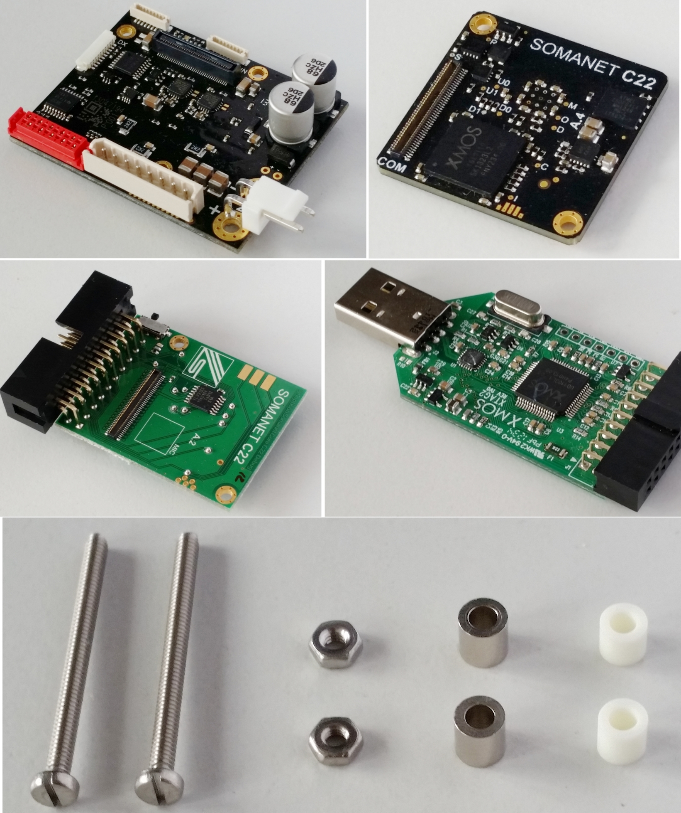

   Required components and assembly parts

It is recommended to start assembly from the IFM Drive DC 100 board. Please place the long metal screws in two holes as shown in image bellow. Use 4 mm metal spaces between the IFM and the Core modules.

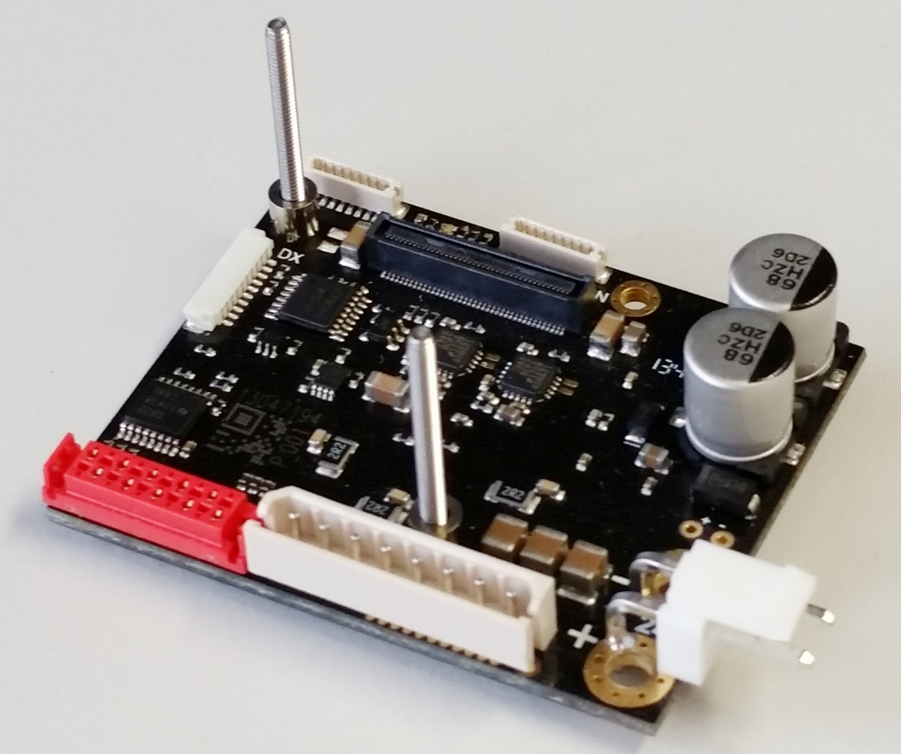

   Step 1

Then proceed with the SOMANET Core module. Please hold the screws with your fingers to prevent them from falling out during the assembly procedure. Make sure that you connected the IFM side connector of the Core module to the IFM Drive DC 100 board. The IFM connector of the Core module has ``IF`` marking next to it. As a result you should see the ``COM`` connector being on top. For mounting the Core to XTAG2 Adapter in the next step please use the white plastic 3.5 mm spacers. 

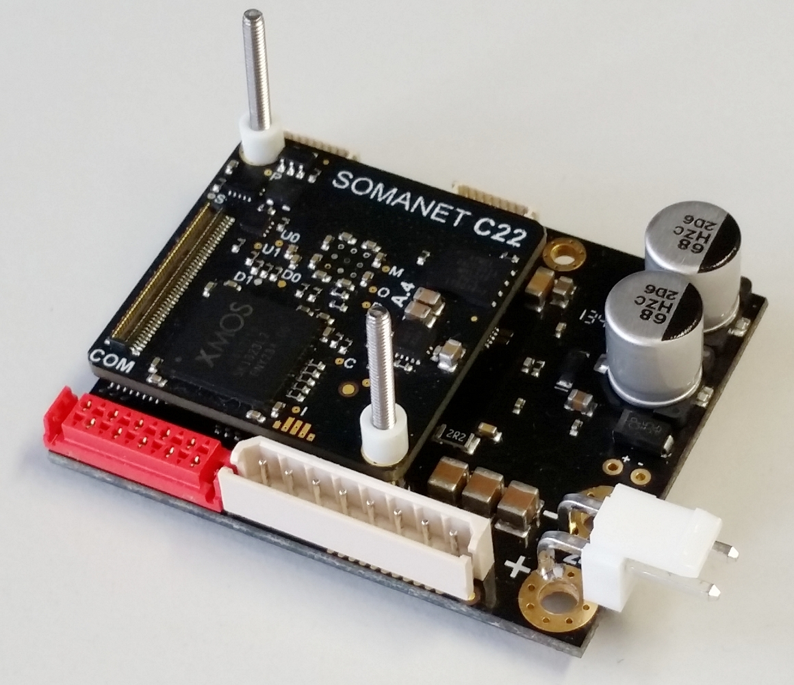

   Step 2

When mounting the Core to XTAG2 Adapter please fixate the IFM connector side with your thumb to prevent from unplugging. Also be careful with the golden pins of the Core to XTAG2 Adapter not to bend them or to break. The golden pins should have a reliable contact at the end with the corresponding pads of the SOMANET core C22 module. When successfully mounted, please fixate the stack with the metal nuts. The stack is ready to use.

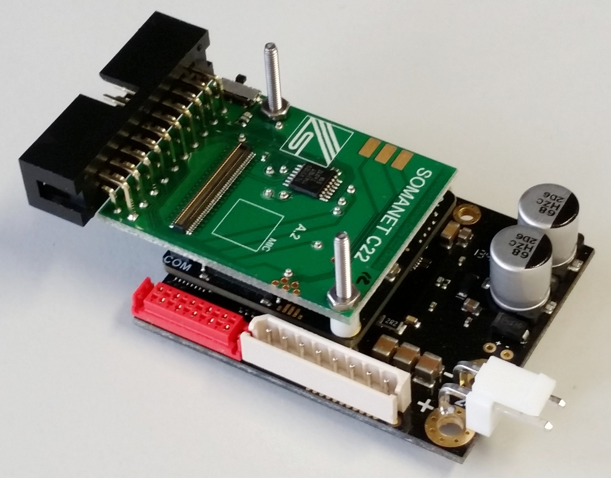

   Step 3

All you need now to start programming is to connect the XMOS XTAG2 adapter as shown in image bellow. Note that the USB cable and a power supply are not included into the kit. 

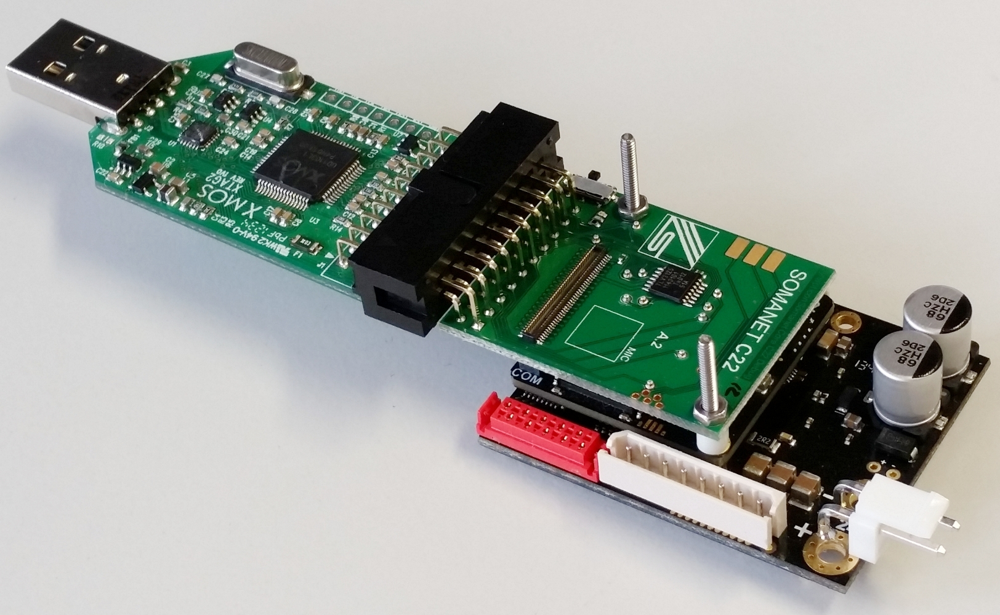

   Step 4

Setting up with COM-EtherCAT module
+++++++++++++++++++++++++++++++++++

This setup is required if you want to develop an EtherCAT based slave application for SOMANET devices. Before you start, make sure that you have all hardware components and assembly parts at hand. You will require the following items:

   #. One SOMANET IFM Drive DC 100 board.
   #. One SOMANET Core C22 module.
   #. One Core to XTAG2 Debug Adapter.
   #. One XMOS XTAG2 Adapter
   #. Two 25mm M2 screws
   #. Four 4mm metal spacers
   #. Two 3.5mm plastic spacers
   #. Two M2 nuts.

The image bellow illustrates the required set for this hardware setup.

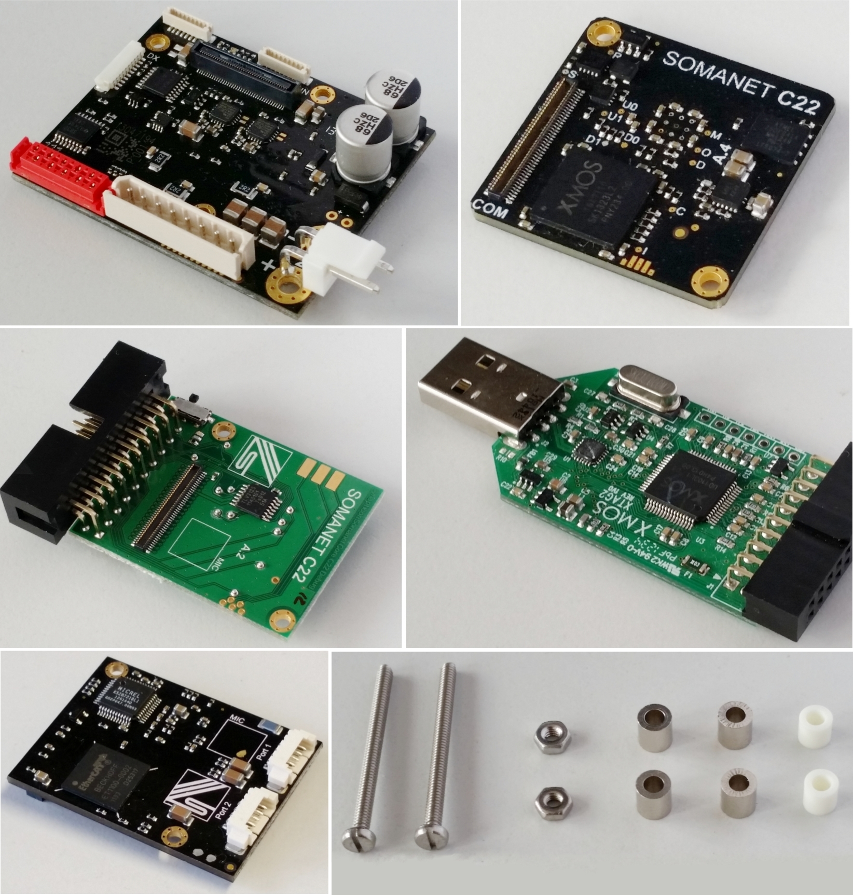

   Required components and assembly parts

To assemble the stack for using with SOMANET COM-EtherCAT please perform steps 1 to 3 as described above. Do not place the metal nuts or remove them. Please use two metal 4 mm spacers instead for mounting the COM-EtherCAT board on top of the Core to XTAG2 Adapter. 

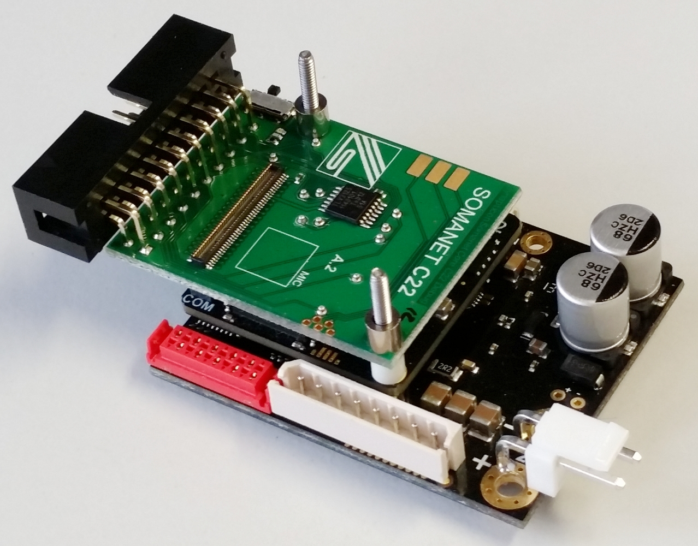

   Step 4

When mounting the COM-EtherCAT board please fixate the IFM connector side of the Core module with your thumb to prevent from unplugging. Press together the modules on the COM connector side and make sure that the all modules are properly plugged. Then fixate the screws with the nuts.

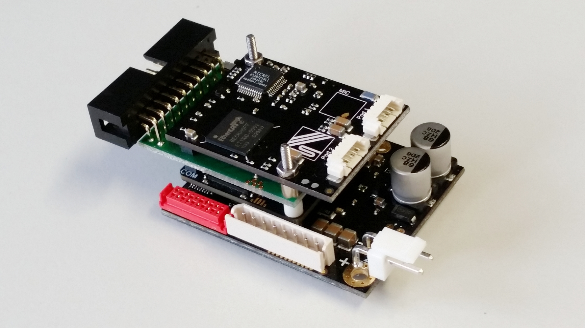

   Step 5

All you need now to start programming is to connect the XMOS XTAG2 adapter as shown in image bellow. Note that the USB cable and a power supply are not included into the kit. 

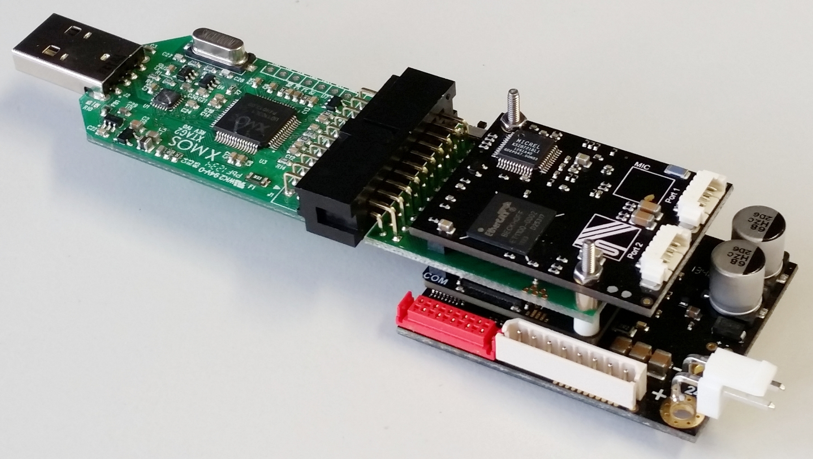

   Step 6

Setting up with COM-EtherCAT module without Core to XTAG2 Adapter
+++++++++++++++++++++++++++++++++++++++++++++++++++++++++++++++++

This setup is useful if software debugging or XScope functionality is not required and you have previosly flashed the SOMANET node with a firmware that includes update functionality via EtherCAT. 

 You will require the following items:

   #. One SOMANET IFM Drive DC 100 board.
   #. One SOMANET Core C22 module.
   #. One XMOS XTAG2 Adapter
   #. Two 25mm M2 screws
   #. Four 4mm metal spacers
   #. Two M2 nuts.

The image bellow illustrates the required set for this hardware setup.

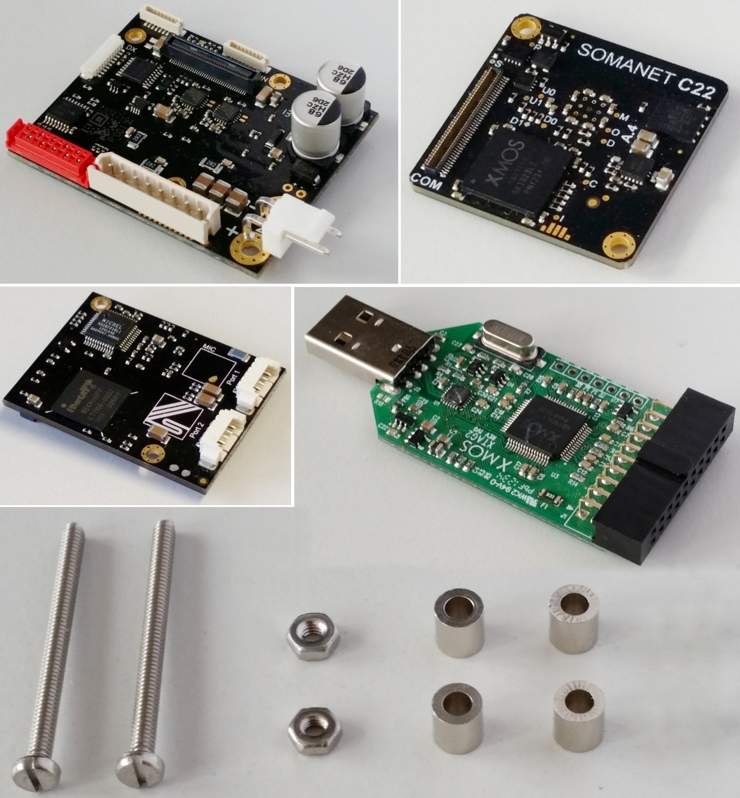

   Required components and assembly parts

To assemble the stack for using with SOMANET COM-EtherCAT without the Core to XTAG2 Adapter please perform step 1 as  described in **Setting up without COM-EtherCAT module** section. Then proceed with the SOMANET Core module. Please hold the screws with your fingers to prevent them from falling out during the assembly procedure. Make sure that you connected the IFM side connector of the Core module to the IFM Drive DC 100 board. The IFM connector of the Core module has ``IF`` marking next to it. As a result you should see the ``COM`` connector being on top. For mounting the COM-EtherCAT module in the next step please use the metal 4 mm spacers. 

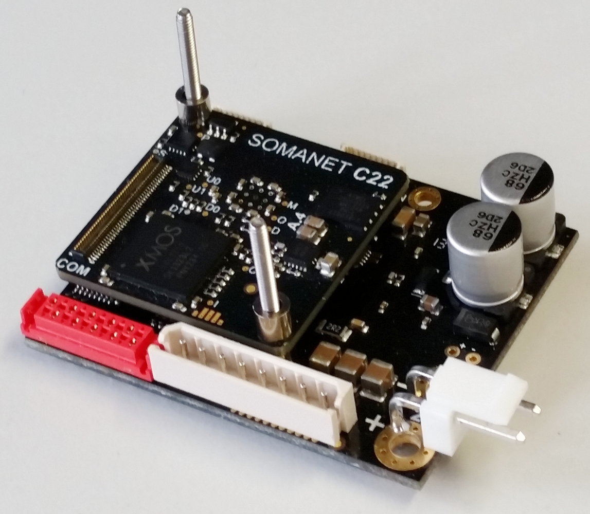

   Step 2

When mounting the COM-EtherCAT board please fixate the IFM connector side of the Core module with your thumb to prevent from unplugging. Press together the modules on the COM connector side and make sure that the all modules are properly plugged. Then fixate the screws with the nuts.

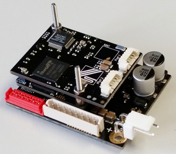

   Step 3

All you need now to start programming the SOMANET stack is to connect the Ethernet cable from the kit to one of the ports of the COM-EtherCAT module and to an Ethernet port of your PC. Note that the power supply is not included into the kit. 

